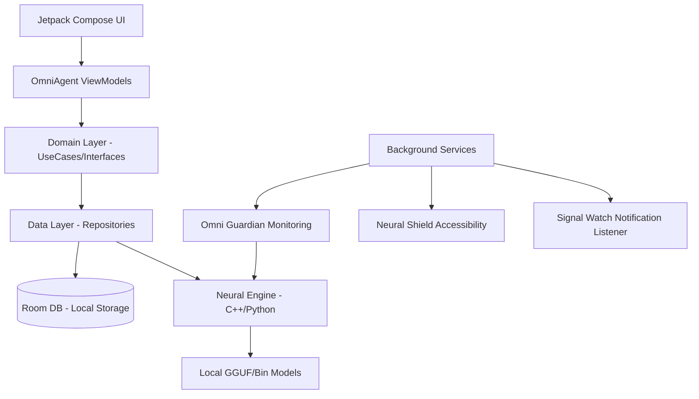

# OmniAgent Android 🛡️🤖

**OmniAgent** is a powerful, AI-driven cybersecurity and monitoring platform for Android. It leverages offline AI models to provide real-time threat detection, vulnerability scanning, and intelligent system monitoring without compromising user privacy.

## 🚀 Features

- **Offline AI Brain**: Download and run advanced AI models locally on your device for private, high-speed analysis.
- **Neural Shield (Accessibility Scanner)**: Real-time scanning of links and UI elements to prevent phishing and malicious interactions.
- **Signal Watch (Notification Listener)**: Monitors incoming notifications for potential security threats or sensitive data leaks.
- **Omni Guardian Service**: A dedicated foreground service for continuous live threat monitoring and system health checks.
- **Secure Logs**: Encrypted activity logs with built-in decryption tools for administrative review.
- **Dynamic Dashboard**: A modern Compose-based UI for managing AI models, viewing reasoning steps, and performing vulnerability scans.
- **Intelligent Widgets**: Quick-access widgets for instant scanning and status updates.

## 🏗️ Architecture

OmniAgent is built using a **Clean Architecture** pattern to ensure modularity and high performance.



## 🛠️ Tech Stack & Pillars

- **The Brain**: A specialized **Neural Engine** using **C++ (NDK)** and **Chaquopy** to execute optimized AI models directly on the mobile CPU/GPU.
- **The Shield**: High-privilege services including **Accessibility Services** for UI scanning and **Notification Listeners** for real-time safety monitoring.
- **The Vault**: **Room Database** for encrypted local storage of logs and analysis results.
- **Performance**: **WorkManager** for scheduled maintenance and **Foreground Services** for persistent protection.

## 🚀 Future Scope

- [ ] **Multi-Model Support**: Support for larger LLMs via dynamic model swapping.
- [ ] **Web Protection**: Integration with browser APIs for deep web threat scanning.
- [ ] **Community Threat Database**: Opt-in anonymous sharing of detected threats to protect other users.
- [ ] **Biometric Lockdown**: Instant app-lock if the AI detects suspicious device usage patterns.

## 📸 Screenshots

> [!TIP]
> Add images of your Dashboard, Analysis Results, and Permission screens here to make your submission visually appealing.

| Dashboard | Analysis Engine | Settings |
| :---: | :---: | :---: |
| _[Image Placeholder]_ | _[Image Placeholder]_ | _[Image Placeholder]_ |

## 📦 Getting Started

### Prerequisites
- **Android Studio Koala** or newer
- **JDK 17+**
- **Android SDK 33+** (Target SDK 34)
- Physical device recommended (for testing Background Services and Accessibility features)

### Installation
1. Clone the repository:
   ```bash
   git clone https://github.com/BhoompallyKalyanReddy/omniagent-android.git
   ```
2. Open the project in **Android Studio**.
3. Sync the project with Gradle files.
4. Run the `app` module on your device.

### Usage
1. **Initial Setup**: On the first launch, use the **Model Selection** tab to download an offline AI brain (approx. 50-200MB depending on the model).
2. **Enable Permissions**: Grant **Accessibility** and **Notification Listener** permissions to enable **Neural Shield** and **Signal Watch**.
3. **Scan**: Use the Dashboard to trigger a "Vulnerability Scan" or input custom queries for the AI to analyze.
4. **Monitor**: View real-time security logs in the Logs tab.

## 📄 License

This project is licensed under the **MIT License**. See the [LICENSE](LICENSE) file for details.

## 👥 Meet the Team

Developed with ❤️ by:
- **Bhoompally Kalyan Reddy** (Lead Developer)
- **Raviraj**(Lead Devloper)
- **Satvendra**(Researcher)
- **Hrushikesh**(Researcher)

---

**Developed for Hackathon Purpose.**
