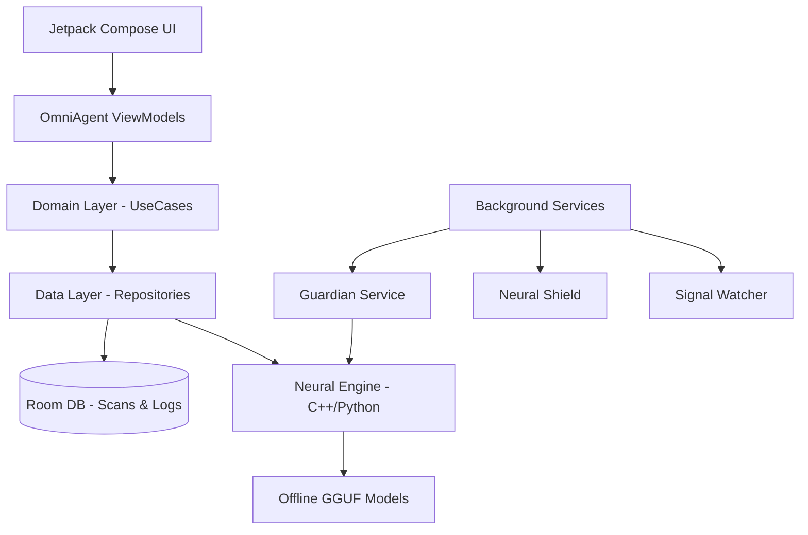
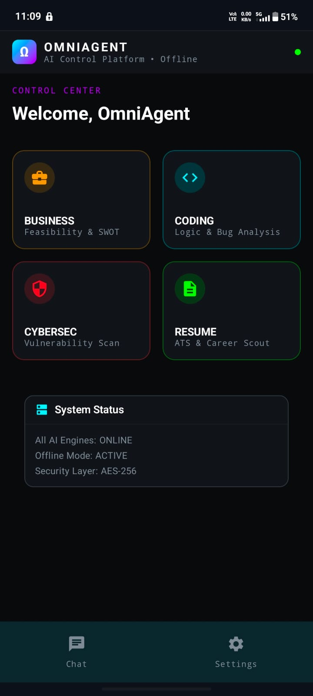
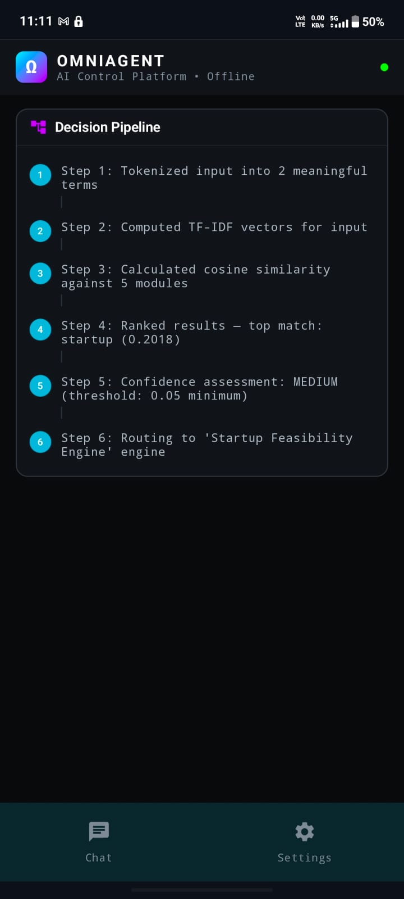
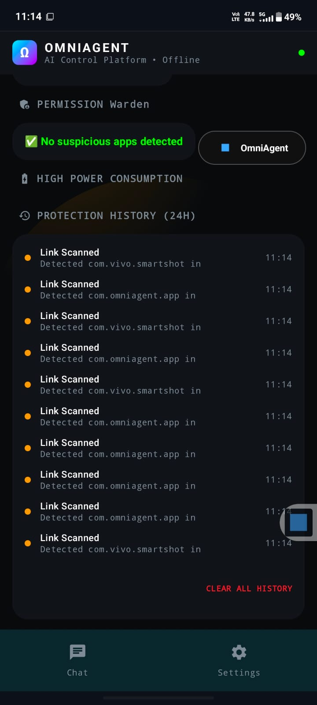

# OmniAgent Android 🛡️🤖

<p align="center">
  
  
  
  
  
</p>

**OmniAgent** is a state-of-the-art, AI-powered cybersecurity and system monitoring platform for Android. It integrates advanced **Offline AI Models** providing real-time threat detection, automated vulnerability scanning, and intelligent monitoring—all processed locally on-device to ensure maximum user privacy and zero-latency analysis.

---

## 🚀 Key Features

*   **🧠 Local Neural Engine**: Download and execute sophisticated AI models (LLMs/GGUF) entirely offline using optimized NDK/C++ runtimes.
*   **🛡️ Neural Shield**: Real-time accessibility-based scanner that analyzes UI elements and links for phishing or malicious patterns.
*   **👁️ Signal Watch**: Continuous notification monitoring to intercept sensitive data leaks and security threats.
*   **👮 Omni Guardian**: A persistent foreground protection service that monitors system health and background processes.
*   **📊 Dynamic UI/UX**: A premium Material 3 experience with Jetpack Compose, featuring real-time reasoning visualization and threat level dashboards.

---

## 🏗️ Architecture Design

OmniAgent follows **Clean Architecture** principles to maintain a separation of concerns between UI, Business Logic, and Data Management.



---

## 📁 Media & Asset Management

### Tracking the Intro Video
The application features a cinematic introduction video used in the `SplashScreen`. You can find the source file here:
- **Path**: `app/src/main/res/raw/omniagent.mp4`

### How It's Referenced
The video is loaded using **Media3 ExoPlayer** with hardware acceleration. To track or update this asset in code, reference the resource ID:
```kotlin
// Example reference in SplashScreen.kt
val mediaUri = "android.resource://${context.packageName}/${R.raw.omniagent}"
val mediaItem = MediaItem.fromUri(mediaUri)
```

---

## 🛠️ Technical Pillars

*   **Language**: 100% Kotlin with Jetpack Compose.
*   **Engine**: **NDK (C++)** and **Chaquopy** for high-performance AI inference.
*   **Security**: High-privilege **Accessibility Services** & **Notification Listeners**.
*   **Persistence**: **Room Database** for encrypted local storage.
*   **Scheduling**: **WorkManager** for periodic system audits.

---

## 📦 Getting Started

### Prerequisites
- **Android Studio Ladybug** or newer.
- **JDK 17+**.
- **Android SDK 34** (Target SDK).
- Physical device recommended for testing Accessibility & Notification features.

### Installation & Setup
1. **Clone**: `git clone https://github.com/BhoompallyKalyanReddy/omniagent-android.git`
2. **Open**: Workspace in **Android Studio**.
3. **Sync**: Let Gradle download dependencies (Neural Engine components).
4. **Deploy**: Build and run the `app` module on a connected device.

---

## 📸 Interface Preview & Guide

To fully showcase **OmniAgent**, please add screenshots of the following key screens:

1.  **Dashboard**: The primary control center showing the current "Threat Level".
2.  **AI Engine**: The screen showing reasoning steps or model selection.
3.  **Logs**: The scrollable list of security events.
4.  **Accessibility**: The screen where users grant "Neural Shield" permissions.

> [!TIP]
> **To add your own screenshots:**
> 1. Run the app and take screenshots on your phone/emulator.
> 2. Save them as `screenshot1.png`, `screenshot2.png`, etc., in a folder named `screenshots/` in the root directory.
> 3. Replace the `_[Image Placeholder]_` text below with the path to your image: ``

| Premium Dashboard | AI Reasoning | Security Logs |
| :---: | :---: | :---: |
|  |  |  |

---

## 📄 License

This repository is distributed under the **MIT License**. Check [LICENSE](LICENSE) for full details.

## 🤝 The Team

Crafted with passion for the **Hackathon 2026** by:
- 👑 **Bhoompally Kalyan Reddy** (Lead Developer)
- 🚀 **Raviraj** (Lead Developer)
- 🔍 **Satvendra** (Security Researcher)
- 🧪 **Hrushikesh** (AI Researcher)

---
<p align="center">Built for the future of mobile security. 🛡️🌍</p>
